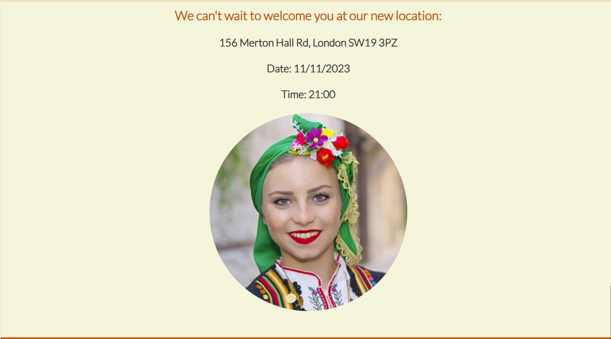
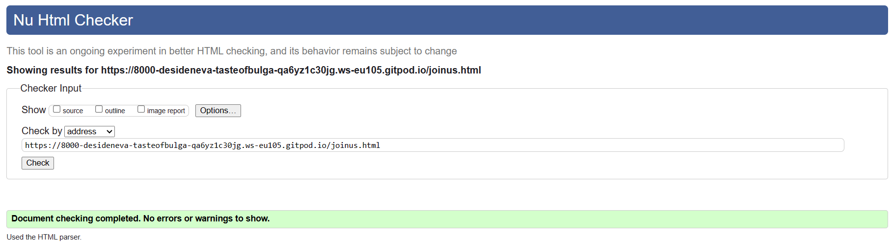
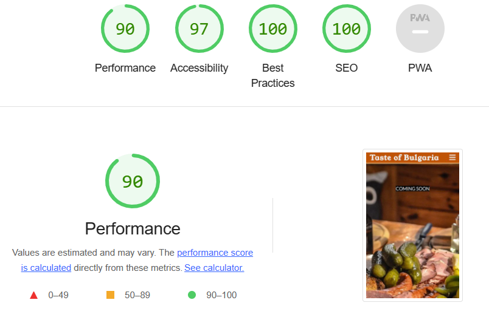
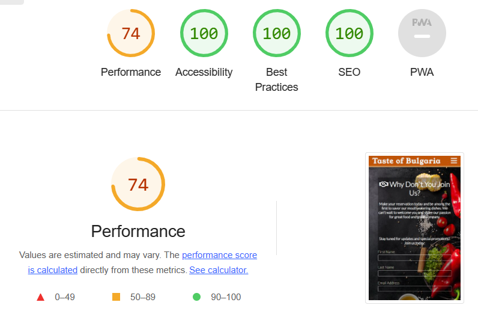

# Welcome to "Taste of Bulgaria" - A Culinary Journey
  
 "Taste of Bulgaria" is more than just a restaurant, it's a culinary journey into the heart of Bulgaria. The project is intended for food enthusiasts, adventurers, and anyone seeking a unique and delightful dining experience. "Taste of Bulgaria," offers not just meals but memories. The project is designed to introduce all food lovers to the tastes and aromas of Bulgaria, ensuring that each dish bursts with authentic flavor.
 
 

 Visit the deployed site: [Taste of Bulgaria](https://desideneva.github.io/taste-of-bulgaria/)

 ## Existing Features

###  _Navigation Bar_

- Featured on all three pages, the full responsive navigation bar includes links to the Logo, Home page, Gallery and Join Us page and is identical in each page to allow for easy navigation.

- This section will allow the user to easily navigate from page to page across all devices without having to revert back to the previous page via the ‘back’ button.

### _The Landing Page Image_

- The landing includes a photograph that grab user`s attention on a few of the most well known traditional Bulgarian dishes in a typical traditional environment.

### _Announcement Section_

- This section was designed to keep users informed about the grand opening of a new Bulgarian restaurant.

### _Menu Section_ 

- A specially designed menu for the opening day,  bursting with authentic flavor, takes the user through Bulgaria's regions, from the Rhodope Mountains to the Black Sea coast.

### _Welcome Section_

- This section allows the user to see exactly when the opening  will happen, the exact location, and the time.

- The image on the side captures the essence of the restaurant – a warm, genuine, and welcoming atmosphere. The smiling female adorned in a traditional Bulgarian costume embodies the friendliness and warmth that awaits the user.

### _The Footer_

- The footer section includes links to the relevant social media sites for Love Running. The links will open to a new tab to allow easy navigation for the user.

- The footer is valuable to the user as it encourages them to keep connected via social media.

### _Gallery_

- The gallery will provide the user with supporting images to see what the restaurant and some of the meals look like.

- The gallery provides users with a visually appealing experience and adds significant value by offering a visual, culinary, and cultural experience to users. 

### _The Join Us Page_

-  Users are encouraged to engage with the restaurant by taking action on the "Join Us" page. Whether it's making a reservation, signing up for updates, or reaching out, this engagement builds a stronger connection between the user and the restaurant. The user will be asked to submit their full name and email address.

### _Features Left to Implement_

- Main Page Slideshow: Enhance the main page by adding an engaging image slideshow. This dynamic element will provide an eye-catching visual experience for the users.

- Gallery Page Videos: Enrich the Gallery page by incorporating short videos from various events, such as folklore evenings, engagement parties, and kids' parties. These videos will give users an immersive glimpse into the vibrant atmosphere and experiences offered at the restaurant.

- Discount Popup on Join Us: Upon signing up on the "Join Us" page, implement a feature where a welcoming message with a 10% discount offer for the first booking pops up. This tempting promotion will encourage users to take immediate action, making it even more motivating to join an event at the restaurant or savor its delicious meals with family and friends.
 
These forthcoming features will make the website more interactive, captivating, and appealing to a broader audience, ultimately enhancing the user experience and encouraging participation in the restaurant's events and culinary delights.

## Solved Bugs

- Navbar Toggle: The toggle for the navbar appeared under the heading instead of next to it due to a spelling mistake in the CSS. "position: absolute" was applied incorrectly, missing the "e" at the end.

- Spelling Mistake: Another spelling mistake had a significant impact on the navbar. "a: hoover;" was used instead of "a: hover;" in the CSS, causing unintended behavior.

- Image Size Issue: Three images for the main page were of different sizes, and efforts to compress and resize them were ineffective. As a solution, the idea was changed, and a "Welcome" section was created instead, which resolved the issue.

- Media Query Issue: When applying the "Form" section under a media query, it unintentionally prevented the background image from appearing on the "Join Us" page, leading to an unexpected display problem.

- Bracket Closing Mistake: Forgetting to close a bracket resulted in various unintended consequences, such as the text not appearing on the screen, the color changing unexpectedly, the text font altering, or text alignment issues. Identifying and resolving these bracket-related bugs was time-consuming.

These experiences highlight the importance of thorough testing and attention to detail during project development.

## Technologies Used

### _Languages_

### _Version Control_

### _Browsers_

 
### _Wireframes_

### _Site Deployment_

## Deployment

### _Initial Deployment_

This site was deployed using GitHub Pages with the following steps below:

1. Login or Sign Up to [GitHub](www.github.com).
2. Create a new repository named "Taste-of-Bulgaria".
3. Once created, click on "Settings" on the navigation bar under the repository title.
4. Click on "Pages", on the left-hand side below Secrets.
5. Under "Source", choose which branch you wish to deploy, In most cases, it will be "main".
6. Choose which folder to deploy from, generally from "/root".
7. Click "Save", then wait for it to be deployed. It may take some time for the page to be fully deployed.
8. The URL will be displayed above the "source" section in GitHub Pages.

### HOW TO FORK A REPOSITORY

If you need to make a copy of a repository:

1. Login or Sign Up to [GitHub](www.github.com).
2. On GitHub, go to [manni8436/Legend-of-the-Greek-Gods](https://github.com/desideneva/taste-of-bulgaria).
3. In the top right corner, click "Fork".

### HOW TO CLONE A REPOSITORY

If you need to make a clone:

1. Login to [GitHub](www.github.com).
2. Fork the repository manni8436/Legend-of-the-Greek-Gods using the steps above in [How To Fork a Repository](#how-to-fork-a-repository).
3. Above the file list, click "Code".
4. Choose if you want to close using HTTPS, SSH or GitHub CLI, then click the copy button to the right.
5. Open Git Bash.
6. Change the directory to where you want your clone to go.
7. Type git clone and then paste the URL you copied in step 4.
8. Press Enter to create your clone.

### HOW TO MAKE A LOCAL CLONE

If you need to make a local clone:

1. Login to [GitHub](www.github.com).
2. Under the repository name, above the list of files, click "Code".
3. Here you can either Clone or Download the repository.
4. You should close the repository using HTTPS, clicking on the icon to copy the link.
5. Open Git Bash.
6. Change the current working directory to the new location, where you want the cloned directory to be.
7. Type git clone and then paste the URL you copied in step 4.
8. Press Enter, and your local clone will be created.

## Testing

Every aspect of the project was tested on the browsers below.

### _User Testing_

- The navigation menu needs to be simple to use on a range of devices, including desktop, tablet and mobile.

  - The navigation bar is visible on all pages with an indicator to show which page the user is on.
  - The navigation bar is easy to read and easy to understand what each button does.

- Maneuvering around the site should be simple and straightforward  

  - Everything is laid out in a clear manner that is simple to use.
  - The navigation bar is clear and visible at the top of each page.

- The images should be clear and not stretched or squashed

  - All images are visibly clear on all pages.

### _Styling and Layout_

| Expected    | Result |
| :---------: | :----: |
| Ensure images loads correctly and functioning as expected | Pass |
| Ensure all images loads correctly | Pass |
| Ensure all backgrounds images load correctly | Pass |
| Ensure main page header loads correctly | Pass |

### _Responsiveness_

| Page | Images and Content Responsive | Text Content Readable    |
| :--: |:----------------------------: | :----------------------: |
| Home Page | Pass | Pass |
| Gallery Page | Pass | Pass |
| Join Us Page | Pass | Pass |

### _Code Validators_

The W3C Markup and CSS Validators were used to validate my project to make sure there were no errors within the site. 

 - Home page
 

 - Gallery page
 

 - Join Us page
 

  
   

### _Lighthouse Testing_ 

- Desktop

- Mobile

#### Performance

- I was very happy with my initial lighthouse scores.
- The issues reducing my performance scores are that I have a large size images, including background images.
- My mobile scores are lower due to the scaling down of images and text for use on mobile.

#### Accessibility

- While writing my code, I was careful to ensure that it was fully accessible.
- All text has good visibility on the background I chose.

#### Best Practices

- All images are shown in the correct aspect ratio, so as not to look stretched or pixelated.

#### SEO

* I ensured the site had all the relevant meta tags needed.
* All font sizes are legible on all screen sizes.

 

 

 

 